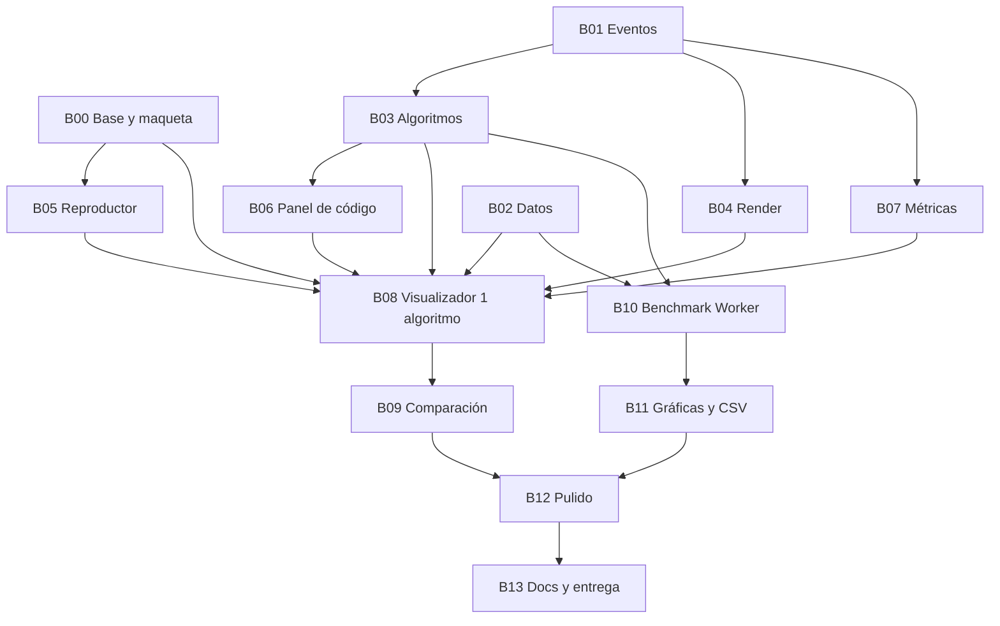

# BLOQUES.md: Registro de desarrollo modular

**Proyecto:** Visualizador y comparador de algoritmos de ordenamiento
**Equipo:** Ultima Chance (Johan Daniel Gutierrez Nava)
**Repositorio:** https://github.com/Souls-Nao/visualizador-ordenamientos
**Tablero:** https://github.com/users/Souls-Nao/projects/2/views/1
**Sitio publicado:** https://souls-nao.github.io/visualizador-ordenamientos/

Este documento es la **fuente de verdad** de la arquitectura. Registra cada bloque de desarrollo: qué
archivos crea, qué **exporta** (su contrato), qué **consume** de bloques anteriores y qué variables,
constantes, IDs del DOM y eventos introduce. Antes de programar un bloque se lee este archivo; al
terminarlo se actualiza su ficha y la bitácora.

> La numeración de bloques es la misma que ya usan los comentarios del código
> (`Bloque 01 — Contrato de eventos`, `Bloque 02 — Generación de datos`, etc.).
> B00 se agregó después para la base de la página, que no existía.

---

## 0. Reglas de trabajo por bloques

1. **Orden.** Un módulo solo importa módulos de bloques con número menor o igual. La única excepción es
   `js/main.js`, que es el *punto de montaje*: cada bloque agrega ahí su inicialización.
2. **Contratos congelados.** Cuando un bloque se marca ✅, sus exportaciones (nombres, parámetros,
   forma de los objetos) no se cambian. Si hace falta, se anota **antes** en la sección 5 *Cambios de
   contrato* y se actualizan en el mismo commit todos los bloques que lo consumen.
3. **Una sola fuente por dato.** Cada constante vive en un único archivo (ver 3.2). Nadie repite a mano
   un color, un límite, un tipo de evento o un ID.
4. **El algoritmo no dibuja.** Los generadores solo emiten eventos (B01); nunca tocan DOM ni canvas.
5. **La lista base no se muta.** Todo módulo trabaja sobre una copia (`[...lista]`).
6. **Terminado** = criterio del backlog cumplido + `test.html` en verde + sin errores en consola +
   commit subido + ficha y bitácora actualizadas aquí.
7. **Commits por bloque.** Mensaje con prefijo: `B04 D-08: dibujar barras con colores por estado`.

### Leyenda de estado

| Símbolo | Significado |
|---|---|
| ⬜ | Pendiente |
| 🟨 | En progreso / hecho con correcciones pendientes |
| ✅ | Terminado (contrato congelado) |
| ⏸️ | Recortado o pospuesto (plan de recorte 6.6) |

---

## 1. Mapa de bloques

| Bloque | Nombre | Tareas backlog | Depende de | Hito | Estado |
|---|---|---|---|---|---|
| B00 | Base, maqueta y publicación | D-01, D-02, D-03 | — | H1 | ✅ |
| B01 | Contrato de eventos | D-04 | — | H2 | ✅ |
| B02 | Generación de datos | D-11 | — | H3 | ✅ |
| B03 | Algoritmos generadores y registro | D-05, D-06, D-07, T-01, T-02 | B01 | H2 | ✅ |
| B04 | Render: espejo y barras en canvas | D-08 | B01 | H3 | ⬜ |
| B05 | Reproductor y velocidad | D-09, D-10 | B00 | H3 | ⬜ |
| B06 | Panel de código y líneas de Python | D-14 | B03 | H4 | ⬜ |
| B07 | Métricas: contadores y mensaje | D-13 | B01 | H3 | ⬜ |
| B08 | Visualizador de un algoritmo | D-12, D-13 (UI) | B02–B07 | H3 | ⬜ |
| B09 | Comparación: varios paneles y resumen | D-15, D-16 | B08 | H4 | ⬜ |
| B10 | Benchmark: versiones fieles y Worker | D-17, D-18 | B02, B03 | H5 | ⬜ |
| B11 | Benchmark: gráficas, tabla y CSV | D-19, D-24 (CSV) | B10 | H5 | ⬜ |
| B12 | Pulido, pestañas y extras | D-20, D-23, D-24 | B09, B11 | H5 | ⬜ |
| B13 | Documentación, pruebas finales y entrega | D-21, T-03, D-22, E-01 | todos | H5–H6 | ⬜ |

### Grafo de dependencias



### Flujo de datos en tiempo de ejecución (visualizador)

```
generarDatos (B02) ──► listaBase ──copia──► PanelAlgoritmo (B08)
                                                 │
                         ALGORITMOS[id].generador (B03) ──yield──► evento (B01)
                                                 │                    │
                  ┌──────────────────────────────┼────────────────────┤
                  ▼                              ▼                    ▼
       aplicarEvento(espejo) (B04)   registrarEvento(contadores) (B07)   evento.line
                  │                              │                    │
       canvasBarras.dibujar (B04)     contadores + mensaje en DOM    panelCodigo.resaltar (B06)

Reproductor (B05) ──alAvanzar(n)──► Escena (B09) ──avanzar(n)──► cada PanelAlgoritmo (B08)
```

---

## 2. Estructura de archivos

Los archivos marcados con ✔ ya existen en el repositorio.

```
/
├── index.html                    B00  maqueta con todos los IDs de la sección 3.3
├── test.html                  ✔  B03  pruebas; crece con cada bloque
├── README.md                     B13
├── BLOQUES.md                        este archivo
├── .nojekyll                     B00  GitHub Pages sirve los archivos tal cual
├── css/
│   ├── base.css                  B00  variables, reset, tipografía, botones y campos
│   ├── layout.css                B00  encabezado, barra de herramientas, grid, adaptable
│   └── componentes.css           B00  panel, código, leyenda, ficha, tablas, formulario
├── js/
│   ├── main.js                   B00  punto de montaje
│   ├── config.js                 B00  límites y ajustes de la interfaz
│   ├── core/
│   │   ├── eventos.js         ✔  B01
│   │   ├── datos.js           ✔  B02
│   │   └── metricas.js           B07
│   ├── algoritmos/
│   │   ├── selectionSort.js   ✔  B03  ┐
│   │   ├── bubbleSort.js      ✔  B03  │
│   │   ├── insertionSort.js   ✔  B03  │
│   │   ├── gnomeSort.js       ✔  B03  │ un generador por archivo
│   │   ├── exchangeSort.js    ✔  B03  │
│   │   ├── stoogeSort.js      ✔  B03  │
│   │   ├── mergeSort.js       ✔  B03  │
│   │   ├── quickSort.js       ✔  B03  ┘
│   │   ├── index.js           ✔  B03  registro ALGORITMOS
│   │   └── fuentesPython.js   ✔  B03  código Python mostrado en pantalla
│   ├── render/
│   │   ├── espejo.js             B04  estado de las barras (lógica pura)
│   │   └── canvasBarras.js       B04  dibujo en canvas y COLORES
│   ├── motor/
│   │   └── reproductor.js        B05
│   ├── ui/
│   │   ├── pestanas.js           B00  cambio de sección
│   │   ├── panelCodigo.js        B06
│   │   ├── panelAlgoritmo.js     B08
│   │   ├── controles.js          B08
│   │   ├── ficha.js              B08
│   │   └── escena.js             B09
│   └── benchmark/
│       ├── fieles.js             B10
│       ├── worker.js             B10
│       ├── benchmark.js          B10
│       ├── graficas.js           B11
│       └── csv.js                B11
├── vendor/
│   └── chart.umd.min.js          B11
└── docs/
    ├── eventos.md             ✔  B01
    ├── referencia/               B00  ordenamientos.py, benchmark.py, main.py originales
    │   └── conteos.py            B03  conteos esperados de test.html
    ├── pruebas.md                B07  (opcional: los conteos ya se prueban en test.html)
    ├── boceto/                       entregable 1
    └── capturas/                 B13
```

---

## 3. Convenciones globales

### 3.1 Nombres

| Elemento | Convención | Ejemplo |
|---|---|---|
| Archivos de algoritmos | `<nombre>Sort.js` | `bubbleSort.js` |
| Otros archivos JS | camelCase, español | `panelCodigo.js` |
| Funciones | verbo + sustantivo, camelCase, español | `generarDatos`, `crearEventoComparar` |
| Fábricas de objetos | prefijo `crear` | `crearReproductor()` |
| Constantes | MAYÚSCULAS, con `Object.freeze` si son objetos | `TIPOS_EVENTO`, `PATRONES` |
| IDs de algoritmo (claves de `ALGORITMOS`) | inglés, minúsculas | `'bubble'`, `'quick'` |
| Campos de un evento | inglés (contrato B01) | `type`, `indices`, `line`, `value` |
| IDs del DOM | kebab-case con prefijo de tipo | `btn-reproducir`, `inp-tamano` |
| Clases CSS | BEM simplificado, español | `.panel`, `.panel--activo`, `.codigo__linea--activa` |
| Exportaciones | siempre nombradas, nunca `export default` | |
| Comentarios | JSDoc en español con encabezado `Bloque NN — Nombre` | |

Prefijos de ID: `btn-` botón · `inp-` input · `sel-` select · `lbl-` texto de salida · `zona-`
contenedor · `vista-` sección de pestaña · `tabla-` tabla · `bench-` campo del benchmark.

### 3.2 Constantes compartidas: dónde vive cada una

| Constante | Archivo (bloque) | Valor | Usada por |
|---|---|---|---|
| `TIPOS_EVENTO` | `core/eventos.js` (B01) | `compare, swap, write, pivot, sorted, done` | B03, B04, B07 |
| `ESTADOS_COLOR` | `core/eventos.js` (B01) | `sin-tocar, comparando, intercambio, pivote, ordenado` | B04 |
| `COLOR_POR_TIPO` | `core/eventos.js` (B01) | evento → estado | B04 |
| `RANGO_VALORES` | `core/datos.js` (B02) | `{ minimo: 0, maximo: 10000 }` | B04, B10 |
| `PATRONES` | `core/datos.js` (B02) | `aleatoria, ordenada, invertida, casi-ordenada` | B08, B10 |
| `ALGORITMOS` | `algoritmos/index.js` (B03) | registro de los 8 | B06, B08, B09, B10, B12 |
| `FUENTES_PYTHON` | `algoritmos/fuentesPython.js` (B03) | código Python por algoritmo; se usa vía `ALGORITMOS[id].fuente` | B03, B06 |
| `TAMANO_MIN` / `TAMANO_MAX` / `TAMANO_DEFECTO` | `config.js` (B00) | `5` / `120` / `30` | B08 |
| `LIMITE_STOOGE_VISUAL` | `config.js` (B00) | `30` | B08, B09 |
| `VELOCIDAD_MIN` / `VELOCIDAD_MAX` / `VELOCIDAD_DEFECTO` | `config.js` (B00) | `1` / `2000` / `20` pasos por segundo | B05, B08 |
| `MAX_PASOS_POR_CUADRO` | `config.js` (B00) | `5000` | B05 |
| `LIMITE_STOOGE_BENCH` | `config.js` (B00) | `500` | B10 |
| `CLAVE_PREFERENCIAS` | `config.js` (B00) | `'vo.preferencias'` | B12 |
| `ENLACES` | `config.js` (B00) | URLs del repositorio, tablero y sitio | B00, B12 |
| `COLORES` | `render/canvasBarras.js` (B04) | un color por valor de `ESTADOS_COLOR` | B04, leyenda B08 |
| `GRUPOS_GRAFICAS` | `benchmark/graficas.js` (B11) | las 4 gráficas de `benchmark.py` | B11 |

> Los colores de las barras viven **solo** en `COLORES` (B04), tal como indica el comentario de
> `ESTADOS_COLOR`. La leyenda se genera desde ahí, así que el canvas y la leyenda nunca se desincronizan.

### 3.3 IDs del DOM (contrato entre `index.html` y JS)

Los define B00. Ningún JS usa un ID que no esté aquí; si hace falta uno nuevo, se agrega a esta tabla.

| ID | Elemento | Lo conecta |
|---|---|---|
| `nav-pestanas` | `<nav>` con botones `[data-vista="visualizador"…]` | B00 |
| `vista-visualizador`, `vista-benchmark`, `vista-algoritmos`, `vista-acerca` | `<section class="vista">` | B00 |
| `zona-seleccion` | casillas de algoritmos (las genera JS desde `ALGORITMOS`) | B08 |
| `btn-todos`, `btn-ninguno` | atajos de selección | B09 |
| `inp-tamano`, `lbl-tamano` | range 5–120 y su valor | B08 |
| `sel-patron` | select; sus `value` son los de `PATRONES` | B08 |
| `btn-nueva-lista` | nueva lista con el mismo tamaño y patrón | B08 |
| `btn-reproducir`, `btn-pausar`, `btn-paso`, `btn-reiniciar` | controles de reproducción | B08 |
| `inp-velocidad`, `lbl-velocidad` | range 0–100 (escala logarítmica) y valor en pasos/s | B05, B08 |
| `lbl-aviso` | mensajes de validación (límite de Stooge, etc.) | B08 |
| `zona-paneles` | grid de paneles de algoritmo | B08, B09 |
| `zona-codigo` | panel de código Python | B06 |
| `zona-leyenda` | leyenda de colores | B08 |
| `zona-ficha` | ficha del algoritmo seleccionado | B08 |
| `zona-resumen`, `tabla-resumen` | resumen de la comparación | B09 |
| `form-bench` | formulario del benchmark | B10 |
| `bench-inicio`, `bench-incremento`, `bench-fin`, `bench-repeticiones`, `bench-patron` | campos | B10 |
| `btn-bench-ejecutar`, `btn-bench-cancelar` | botones | B10 |
| `bench-progreso`, `bench-mensaje` | `<progress>` y texto de estado | B10 |
| `zona-graficas`, `tabla-bench` | salidas | B11 |
| `btn-bench-csv` | exportar CSV | B11 |
| `tabla-algoritmos` | tabla de la pestaña Algoritmos | B12 |
| `enlace-repo`, `enlace-tablero` | enlaces de la pestaña Acerca | B00 |

### 3.4 Clases CSS (contrato entre CSS y JS)

| Clase | Uso | Bloque |
|---|---|---|
| `.vista`, `.vista--activa` | secciones por pestaña; solo la activa se ve | B00 |
| `.pestana`, `.pestana--activa` | botones de navegación | B00 |
| `.oculto` | `display: none` | B00 |
| `.panel`, `.panel--activo`, `.panel--terminado` | tarjeta de un algoritmo | B00 (estilo), B08 |
| `.panel__cabecera`, `.panel__titulo`, `.panel__lienzo`, `.panel__contadores`, `.panel__mensaje` | partes del panel | B00, B08 |
| `.codigo`, `.codigo__linea`, `.codigo__num`, `.codigo__linea--activa` | panel de código | B00, B06 |
| `.leyenda__item`, `.leyenda__color` | leyenda | B00, B08 |
| `.ficha`, `.ficha__tabla` | ficha del algoritmo | B00, B08 |
| `.aviso`, `.aviso--error` | mensajes | B00 |
| `.marcador` | contenido provisional que un bloque posterior reemplaza | B00 |

---

## 4. Fichas de bloques

---

### B00: Base, maqueta y publicación ✅

- **Tareas:** D-01, D-02, D-03 · **Depende de:** — · **Commits:** ver bitácora (prefijo `B00`)
- **Objetivo:** página estática que ya tiene todos los contenedores e IDs de 3.3, se ve como el boceto,
  cambia de pestaña y está publicada en GitHub Pages.

**Archivos:** `index.html`, `.nojekyll`, `.gitignore`, `css/base.css`, `css/layout.css`,
`css/componentes.css`, `js/main.js`, `js/config.js`, `js/ui/pestanas.js`,
`docs/referencia/{ordenamientos,benchmark,main}.py` (recuperados del primer commit).
Además se elimina el archivo `-Nao main --rebase`, que se subió por error y exponía la configuración de git.

**Exporta (contrato):**
```js
// js/config.js
export const TAMANO_MIN, TAMANO_MAX, TAMANO_DEFECTO, LIMITE_STOOGE_VISUAL,
             VELOCIDAD_MIN, VELOCIDAD_MAX, VELOCIDAD_DEFECTO, MAX_PASOS_POR_CUADRO,
             LIMITE_STOOGE_BENCH, CLAVE_PREFERENCIAS, ENLACES;

// js/ui/pestanas.js
export function iniciarPestanas(nav = document.getElementById('nav-pestanas')) {}
// Botón [data-vista="x"] → muestra #vista-x (clase .vista--activa), marca .pestana--activa,
// actualiza location.hash (#benchmark) y lo respeta al cargar.
```
`js/main.js` es el único `<script type="module">` de `index.html`.

**Variables CSS (`base.css`):** `--fondo`, `--superficie`, `--superficie-2`, `--texto`,
`--texto-suave`, `--borde`, `--acento`, `--acento-texto`, `--error`, `--radio`, `--sombra`,
`--esp-1`…`--esp-5` (4/8/12/16/24 px), `--fuente`, `--fuente-mono`. Tema claro y oscuro con
`prefers-color-scheme`.

**Consume:** nada.
**Criterio:** abre con `python -m http.server` sin errores en consola; se ve bien a 360 px y a 1280 px;
las 4 pestañas cambian de sección; la URL pública muestra la maqueta.
**Decisiones / notas:**
- Los controles aparecen en la maqueta pero todavía no hacen nada; los conecta B08.
- Las opciones de `#sel-patron` y `#bench-patron` están escritas en el HTML con los mismos `value` que
  `PATRONES` (B02). B08 agrega una prueba que verifica que coincidan.
- Los textos con clase `.marcador` indican qué bloque llenará cada zona; se eliminan al conectarla.
- `#inp-velocidad` arranca en 39, que en escala logarítmica de 1 a 2000 equivale a 20 pasos/s
  (`VELOCIDAD_DEFECTO`); B05 define la fórmula exacta.
- La pestaña activa se guarda en `location.hash`, así que `…/#benchmark` abre directo esa sección.
- Se recuperaron los `.py` originales en `docs/referencia/` porque B06 (código en pantalla) y B10
  (versiones fieles) se basan en ellos.
- Servidor local: `python -m http.server 8765` y abrir `http://localhost:8765`.

**Verificación (25/09/2026):** sin errores en consola; existen los 41 IDs de 3.3; las 4 pestañas
cambian de sección y respetan el hash; sin desborde horizontal a 375 px; distribución correcta a 800
y 1280 px.

**Publicación (25/09/2026):** GitHub Pages activo desde *Settings → Pages → Deploy from a branch →
`main` / `/ (root)`*. La URL pública responde 200, carga los módulos JS y CSS, cambia de pestaña y no
muestra errores en consola. Cada `push` a `main` actualiza el sitio automáticamente.

---

### B01: Contrato de eventos ✅

- **Tareas:** D-04 · **Depende de:** — · **Commits:** `3b71c07`, `2d0dd8e`
- **Archivos:** `js/core/eventos.js`, `docs/eventos.md`

**Exporta (contrato):**
```js
export const TIPOS_EVENTO = { COMPARAR:'compare', INTERCAMBIAR:'swap', ESCRIBIR:'write',
                              PIVOTE:'pivot', ORDENADO:'sorted', TERMINADO:'done' };
export const ESTADOS_COLOR = { SIN_TOCAR:'sin-tocar', COMPARANDO:'comparando',
                               INTERCAMBIO:'intercambio', PIVOTE:'pivote', ORDENADO:'ordenado' };
export const COLOR_POR_TIPO = { compare:'comparando', swap:'intercambio', write:'intercambio',
                                pivot:'pivote', sorted:'ordenado' };
export function crearEventoComparar(i, j, line)       // { type:'compare', indices:[i,j], line }
export function crearEventoIntercambiar(i, j, line)   // { type:'swap',    indices:[i,j], line }
export function crearEventoEscribir(index, value, line)// { type:'write',  indices:[index], value, line }
export function crearEventoPivote(index, line)        // { type:'pivot',   indices:[index], line }
export function crearEventoOrdenado(index, line)      // { type:'sorted',  indices:[index], line }
export function crearEventoTerminado()                // { type:'done' }
```
**Reglas:** ningún evento lleva el arreglo completo; el consumidor mantiene un espejo. `done` es
siempre el último evento. `line` es 1-indexado dentro de `ALGORITMOS[id].fuente` (ver cambio de
contrato del 25/09/2026 en la sección 5).
**Regla de conteo** (la aplica B07, igual para los 8): `compare` → comparaciones +1 · `swap` y
`write` → movimientos +1 · todo evento salvo `done` → pasos +1.

---

### B02: Generación de datos ✅

- **Tareas:** D-11 · **Depende de:** — · **Commits:** `36b94f9`
- **Archivos:** `js/core/datos.js`

**Exporta (contrato):**
```js
export const RANGO_VALORES = { minimo: 0, maximo: 10000 };   // igual que benchmark.py
export const PATRONES = { ALEATORIA:'aleatoria', ORDENADA:'ordenada',
                          INVERTIDA:'invertida', CASI_ORDENADA:'casi-ordenada' };
export function generarDatos(n, patron)  // number[]; RangeError si n no es entero >= 0; Error si el patrón no existe
```
**Notas:** no valida límites de la interfaz (5–120); eso lo hace B08 con `config.js`, porque el
benchmark (B10) necesita listas más grandes. "Casi ordenada" desordena el 5 % (mínimo 1 intercambio).

---

### B03: Algoritmos generadores y registro ✅

- **Tareas:** D-05, D-06, D-07, T-01, T-02 · **Depende de:** B01 · **Commits:** `1bafb70` + ver bitácora
- **Archivos:** `js/algoritmos/*Sort.js` (8), `js/algoritmos/fuentesPython.js`,
  `js/algoritmos/index.js`, `test.html`

**Exporta (contrato):**
```js
// cada archivo *Sort.js
export function* bubbleSort(arregloInicial) {}   // copia la entrada, emite eventos B01, termina con done

// fuentesPython.js
export const FUENTES_PYTHON = { selection: string[], ..., quick: string[] };   // congelado

// index.js
export const ALGORITMOS = {            // congelado; el orden de las claves es el de la interfaz
  selection: {
    nombre, generador, fuente /* = FUENTES_PYTHON.selection */,
    categoria /* 'fuerza-bruta' | 'divide-y-venceras' */,
    mejor, promedio, peor, espacio, estable /* 'Sí' | 'No' */, descripcion
  },
  bubble, insertion, gnome, exchange, stooge, merge, quick
};
```

**Reglas internas de los generadores:**
- Cada archivo define `const LINEA = { COMPARAR: 7, ... }` con las líneas de su fuente que usa.
  Si se edita una fuente, se revisan esas constantes (`test.html` detecta líneas fuera de rango).
- Solo se emite `sorted` cuando el algoritmo realmente fija una posición (Selection, Bubble,
  Exchange y Quick). Los demás, y Bubble cuando termina antes, dejan que `done` marque todo (B04).

**Relación con la práctica (`docs/referencia/ordenamientos.py`):** la práctica es la base; en JS se
cambió solo lo que mejora el visualizador. El código Python que se muestra en pantalla
(`FUENTES_PYTHON`) incluye esos cambios, así que lo que se anima es exactamente lo que se lee.

| ID | Respecto a la práctica | Por qué |
|---|---|---|
| `selection` | Solo intercambia si `min_idx != i` | No animar ni contar el intercambio de una barra consigo misma |
| `bubble` | Recorre hasta `n - 1 - i` y termina si una pasada no intercambia | No volver a comparar barras ya fijas; mejor caso O(n) |
| `insertion` | Igual | — |
| `gnome` | Igual (con el cortocircuito de `i == 0`) | — |
| `exchange` | Igual | — |
| `stooge` | Igual (recursión con `yield*`) | — |
| `merge` | Índices `lo`/`hi` sobre un solo arreglo y `<=` en lugar de `<` | Dibujarlo como una fila de barras; que sea estable |
| `quick` | En el lugar: pivote al centro y tres grupos (`<`, `==`, `>`) | La versión con listas nuevas no se puede dibujar sobre un arreglo |

El benchmark (B10) usa las funciones originales de la práctica, sin estos cambios.

**Verificación (25/09/2026):** `docs/referencia/conteos.py` lee `fuentesPython.js`, ejecuta ese
Python tal cual y cuenta comparaciones y escrituras (un intercambio = 2 escrituras) en 4 listas
fijas. `test.html` ejecuta 48 pruebas, 6 por algoritmo:
- ordena 27 listas (vacía, 1 y 2 elementos, todos iguales, duplicados, ordenada, invertida y 5
  aleatorias de cada patrón) respetando el contrato de eventos (`line` en rango, índices válidos,
  `done` al final, entrada sin modificar);
- hace **las mismas comparaciones y escrituras que el Python mostrado** en las 4 listas fijas
  (los 8 algoritmos, incluido Quick);
- el registro tiene todos los campos.

Todas pasan en 11 cargas seguidas. Si se cambia una fuente: actualizar el generador, correr
`python docs/referencia/conteos.py` y pegar su salida en `test.html`.

**Decisiones / notas:**
- El criterio original de T-02 ("con n = 5: Bubble 20, Selection 10, Exchange 10") suponía el Bubble
  sin salida temprana. Con la mejora, Bubble hace 10 comparaciones con n = 5 invertida; el criterio
  queda sustituido por "mismos conteos que el Python mostrado".
- En Merge, al comparar se resaltan `lo + i` y `mid + j` (de dónde salieron los valores); la barra
  de la izquierda puede estar ya sobrescrita, porque el valor real está en la copia `izquierda`.
- En Quick, el pivote puede moverse durante la partición: los eventos `compare` siempre apuntan a su
  posición actual.

---

### B04: Render: espejo y barras en canvas ⬜

- **Tareas:** D-08 · **Depende de:** B01 (y `RANGO_VALORES` de B02)
- **Objetivo:** convertir eventos en barras de colores. No sabe nada de algoritmos.

**Archivos:** `js/render/espejo.js`, `js/render/canvasBarras.js`

**Exporta (contrato):**
```js
// espejo.js — lógica pura, sin DOM (se prueba en test.html)
export function crearEspejo(arreglo) {}
// → { valores: number[], estados: string[] /* ESTADOS_COLOR por posición */, terminado: false }
export function aplicarEvento(espejo, evento) {}
// 1) estados que no son 'ordenado' vuelven a 'sin-tocar'
// 2) swap/write modifican valores
// 3) indices del evento toman COLOR_POR_TIPO[evento.type] (sin pisar 'ordenado', salvo con swap/write)
// 4) done → terminado = true y todas las posiciones pasan a 'ordenado'

// canvasBarras.js
export const COLORES = { 'sin-tocar':'…azul', comparando:'…amarillo', intercambio:'…rojo',
                         pivote:'…morado', ordenado:'…verde' };
export function crearCanvasBarras(canvas, { maximo = RANGO_VALORES.maximo } = {}) {}
// → { dibujar(espejo), redimensionar(), destruir() }   // usa ResizeObserver y devicePixelRatio
```
**Notas para implementar:**
- Insertion, Gnome, Stooge y Merge no emiten `sorted`; dependen de que `done` marque todo.
- Quick emite `pivot` una vez por partición y luego `compare(i, posPivote)`; el pivote puede
  moverse con un `swap`. Decidir aquí si el color de pivote persiste durante la partición.

**Criterio:** barras proporcionales con los 5 colores; se adaptan al tamaño del canvas.

---

### B05: Reproductor y velocidad ⬜

- **Tareas:** D-09, D-10 · **Depende de:** B00 (`config.js`)
- **Objetivo:** reloj con `requestAnimationFrame` que decide cuántos pasos tocan en cada cuadro.

**Archivos:** `js/motor/reproductor.js`

**Exporta (contrato):**
```js
export function crearReproductor({ alAvanzar, alCambiarEstado }) {}
// alAvanzar(n) → boolean (true = queda trabajo) · alCambiarEstado('detenido'|'reproduciendo'|'pausado'|'terminado')
// → { reproducir(), pausar(), paso(), detener(), setVelocidad(pps), get estado, get velocidad }
export function velocidadDesdeSlider(t) {}   // t ∈ [0,100] → pasos/s en escala logarítmica
export function sliderDesdeVelocidad(pps) {}
```
- Acumulador: `acumulado += dt * velocidad / 1000; n = Math.floor(acumulado); acumulado -= n`, con
  `n ≤ MAX_PASOS_POR_CUADRO`.
**Criterio:** a 1–5 pasos/s se sigue cada operación; a 500 o más termina en segundos sin trabar la página.

---

### B06: Panel de código y líneas de Python ⬜

- **Tareas:** D-14 · **Depende de:** B03
- **Archivos:** `js/ui/panelCodigo.js` (`fuentesPython.js` y las líneas de los generadores se hicieron en B03)

**Exporta (contrato):**
```js
// panelCodigo.js
export function crearPanelCodigo(contenedor = document.getElementById('zona-codigo')) {}
// → { mostrar(idAlgoritmo), resaltar(line), limpiar() }
```
**Consume:** `ALGORITMOS[id].fuente` (B03). `line` es 1-indexado sobre esa fuente.
**Criterio:** en los 8 algoritmos la línea resaltada corresponde a la operación visible.

---

### B07: Métricas: contadores y mensaje ⬜

- **Tareas:** D-13 (lógica) · **Depende de:** B01
- **Archivos:** `js/core/metricas.js`

**Exporta (contrato):**
```js
export function crearContadores() {}              // { comparaciones: 0, movimientos: 0, pasos: 0 }
export function registrarEvento(contadores, evento) {}   // aplica la regla de conteo de B01
export function describirEvento(evento) {}        // 'Comparando posiciones 3 y 4', 'Intercambiando…', …
export function contarEjecucion(generador) {}     // recorre un generador completo → contadores (pruebas y resumen)
```
**Aquí y solo aquí** se calculan las métricas del visualizador.
**Criterio:** `test.html` usa `contarEjecucion` en lugar de su contador interno y los conteos de
B03 siguen pasando (ojo: B03 cuenta escrituras, con un intercambio = 2; B07 cuenta movimientos,
con un intercambio = 1).

---

### B08: Visualizador de un algoritmo ⬜

- **Tareas:** D-12, D-13 (UI) · **Depende de:** B00, B02–B07
- **Archivos:** `js/ui/panelAlgoritmo.js`, `js/ui/controles.js`, `js/ui/ficha.js`

**Exporta (contrato):**
```js
// panelAlgoritmo.js
export function crearPanelAlgoritmo({ contenedor, id, lista, alSeleccionar, alCambiarLinea }) {}
// → { id, avanzar(n) → boolean, reiniciar(lista), setActivo(bool),
//     get terminado, get contadores, get line, destruir() }
// ficha.js
export function pintarFicha(contenedor, id) {}
export function pintarLeyenda(contenedor) {}      // generada desde COLORES (B04)
// controles.js
export function iniciarControles(escena) {}       // enlaza los IDs de 3.3 con la escena
```
**Estado de la aplicación** (vive en la escena; en B08 con un solo panel):
```js
{ listaBase: [], tamano: TAMANO_DEFECTO, patron: 'aleatoria',
  seleccionados: ['bubble'], panelActivo: 'bubble', velocidad: VELOCIDAD_DEFECTO }
```
**Criterio:** los 8 se animan hasta terminar con barras verdes; "Reiniciar" repite la misma lista.

---

### B09: Comparación: varios paneles y resumen ⬜

- **Tareas:** D-15, D-16 · **Depende de:** B08
- **Archivos:** `js/ui/escena.js`

**Exporta (contrato):**
```js
export function crearEscena({ zonaPaneles, panelCodigo, alTerminarTodos, alCambiarActivo }) {}
// → { setSeleccion(ids), nuevaLista(tamano, patron), reiniciar(), reproducir(), pausar(), paso(),
//     setVelocidad(pps), seleccionarPanel(id), get estado, get resumen }
// resumen: [{ id, nombre, comparaciones, movimientos, pasos, llegada }]
export function pintarResumen(tabla, resumen) {}
```
- Todos los paneles reciben una copia de la **misma** `listaBase` y avanzan con el mismo reproductor.
**Criterio:** con 1, 3 u 8 algoritmos aparecen esos paneles; terminan en momentos distintos y el
resumen muestra valores correctos.

---

### B10: Benchmark: versiones fieles y Worker ⬜

- **Tareas:** D-17, D-18 · **Depende de:** B02, B03
- **Archivos:** `js/benchmark/fieles.js`, `js/benchmark/worker.js`, `js/benchmark/benchmark.js`

**Exporta (contrato):**
```js
export const FIELES = { selection: fn, ..., quick: fn };   // fn(lista) → nueva lista ordenada (traducción de ordenamientos.py)
export function iniciarBenchmark() {}
export function validarConfig(datos) {}   // reglas de main.py → { ok, errores: string[], config }
```
**Protocolo del Worker:** página → `{ tipo:'iniciar', config:{ inicio, incremento, fin, repeticiones, patron, algoritmos } }` ·
worker → `{ tipo:'progreso', hecho, total }` · `{ tipo:'fin', resultados }` · `{ tipo:'error', mensaje }` · cancelar = `worker.terminate()`.

**`resultados`:** `{ tamanos:number[], patron, repeticiones, tiempos:{ id:(ms|null)[] }, omitidos:{ id:motivo } }`
**Criterio:** de 100 a 500 de 100 en 100 devuelve los 8 tiempos, con progreso y sin congelar la página.

---

### B11: Benchmark: gráficas, tabla y CSV ⬜

- **Tareas:** D-19, D-24 (CSV) · **Depende de:** B10
- **Archivos:** `js/benchmark/graficas.js`, `js/benchmark/csv.js`, `vendor/chart.umd.min.js`

**Exporta (contrato):**
```js
export const GRUPOS_GRAFICAS = [
  { titulo: 'Stooge Sort (solo)', ids: ['stooge'] },
  { titulo: 'Fuerza bruta', ids: ['selection','bubble','insertion','gnome','exchange'] },
  { titulo: 'Fuerza bruta vs Merge Sort', ids: [...5 anteriores, 'merge'] },
  { titulo: 'Fuerza bruta vs Quick Sort', ids: [...5 anteriores, 'quick'] },
];
export function dibujarGraficas(contenedor, resultados) {}   // destruye las anteriores
export function pintarTablaBench(tabla, resultados) {}
export function resultadosACSV(resultados) {}
export function descargarCSV(resultados, nombre = 'benchmark.csv') {}
```
**Criterio:** las 4 gráficas y la tabla aparecen; volver a ejecutar no duplica gráficas.

---

### B12: Pulido, pestañas y extras ⬜

- **Tareas:** D-20, D-23, D-24 · **Depende de:** B09, B11
- **Exporta:** `iniciarAtajos(escena)` (Espacio, →, R) · `cargarPreferencias()` / `guardarPreferencias(p)`
  con `CLAVE_PREFERENCIAS` y try/catch · tabla `#tabla-algoritmos` generada desde `ALGORITMOS`.
**Criterio:** sin desbordes horizontales, controles usables con teclado, mensajes claros.

---

### B13: Documentación, pruebas finales y entrega ⬜

- **Tareas:** D-21, T-03, D-22, E-01 · **Depende de:** todos
- **README:** descripción · URL publicada · integrantes · cómo ejecutar (`python -m http.server`) ·
  los 8 algoritmos · arquitectura (enlace a este archivo) · capturas · uso de IA · dónde se calcula
  cada métrica (`metricas.js` B07; tiempos en `worker.js` B10).
**Criterio:** la URL pública muestra la versión final; el repo y el tablero abren en incógnito.

---

## 5. Cambios de contrato

| Fecha | Bloque | Qué cambió | Por qué | Bloques actualizados |
|---|---|---|---|---|
| 25/09/2026 | B01 | `line` pasa de "línea de `ordenamientos.py`" a "línea 1-indexada dentro de `ALGORITMOS[id].fuente`" | Merge y Quick muestran una versión adaptada, y cada panel muestra solo su algoritmo | B03 (todas las líneas), `docs/eventos.md`; B06 aún no existía |
| 25/09/2026 | B03 | `ALGORITMOS[id]` agrega `fuente` y `categoria`; `fuentesPython.js` pasa de B06 a B03 | Sin la fuente no se podían fijar las líneas correctas; `categoria` la usan B10 y B11 | B06 (ficha ajustada, aún sin código) |

---

## 6. Trazabilidad con los requisitos de la actividad

| Requisito | Dónde se cumple |
|---|---|
| 1. Seleccionar el algoritmo | B08 (`#zona-seleccion`) |
| 2. Generar un arreglo | B02 + B08 (`#btn-nueva-lista`) |
| 3. Iniciar la ejecución | B05 + B08 (`#btn-reproducir`) |
| 4. Visualizar gráficamente | B04 + B08 |
| 5. Reiniciar la simulación | B08 (`#btn-reiniciar`, misma `listaBase`) |
| 6. Cambiar la velocidad | B05 + B08 (`#inp-velocidad`) |
| 7. Mostrar el nombre | B03 (`ALGORITMOS[id].nombre`) → B08 |
| 8. Mostrar la complejidad | B03 (`mejor/promedio/peor`) → B08 ficha |
| 9. Mismos datos para comparar | B09 (`listaBase` compartida) |
| Comparación de 2 o más | B09 |
| Evidencia cuantitativa | B07 + B09 (conteos) · B10/B11 (tiempos) |
| 8 algoritmos identificables | B03 (un archivo por algoritmo) |
| Hosting gratuito | B00 / B13 (GitHub Pages) |
| README y documentación | B13 + este archivo + `docs/` |

---

## 7. Bitácora

| Fecha | Bloque | Qué se hizo | Commit(s) | Siguiente paso |
|---|---|---|---|---|
| 20/09/2026 | — | Subida de la práctica original en Python | `7a26b36` | — |
| 25/09/2026 | B01 | Contrato de eventos y `docs/eventos.md` | `3b71c07`, `2d0dd8e` | — |
| 25/09/2026 | B02 | `generarDatos` con 4 patrones | `36b94f9` | — |
| 25/09/2026 | B03 | 8 generadores, registro y `test.html` | `1bafb70` | Correcciones de B03 |
| 25/09/2026 | — | BLOQUES.md alineado con el código existente; se elimina el volcado de git config | `049dc70`, `ccd423b` | B00 |
| 25/09/2026 | B00 | Estructura, `config.js`, pestañas, maqueta completa, `.py` de referencia | `4c0ce68`, `80e2772` | — |
| 25/09/2026 | B00 | Publicación en GitHub Pages verificada; bloque cerrado ✅ | `877c9b4` | — |
| 25/09/2026 | B03 | Generadores traducidos de Python, `fuentesPython.js`, registro corregido y `test.html` con 37 pruebas | `980af8b`, `1f39d47`, `ae40eea` | — |
| 25/09/2026 | B03 | Mejoras para el visualizador (Selection, Bubble, Merge), `conteos.py` y 48 pruebas contra el Python mostrado; bloque cerrado ✅ | ver `git log --grep B03` | B04 (espejo y canvas) |

---

## 8. Plantilla para una ficha nueva

~~~markdown
### BXX: Nombre ⬜

- **Tareas:** · **Depende de:** · **Commits:**
- **Objetivo:**

**Archivos:**

**Exporta (contrato):**
```js
```

**Consume:**
**Constantes nuevas:** (agregarlas también a 3.2)
**IDs / clases nuevas:** (agregarlas también a 3.3 / 3.4)
**Criterio de terminado:**
**Decisiones / notas:**
~~~
