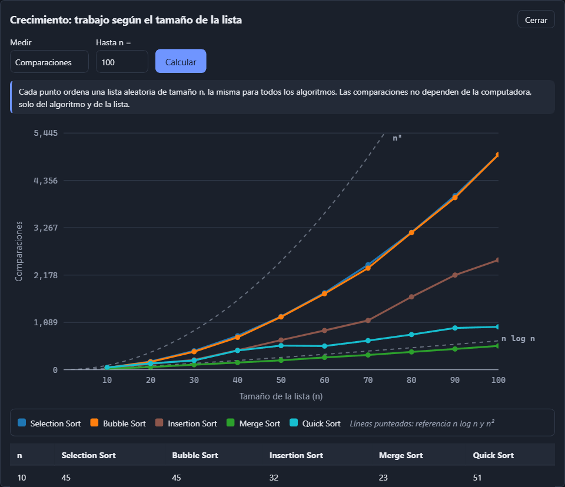
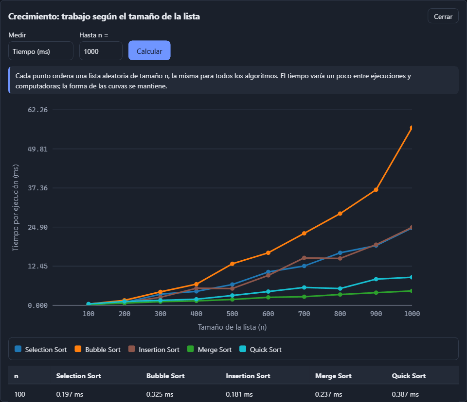

# Visualizador de ordenamientos

Aplicación web para **visualizar, ejecutar y comparar** los ocho algoritmos de ordenamiento vistos
en clase: Selection, Bubble, Insertion, Gnome, Exchange, Stooge, Merge y Quick Sort. Muestra qué
elementos se comparan, cuáles se intercambian, qué línea del código se está ejecutando y cómo
cambia el arreglo hasta quedar ordenado.

**Aplicación publicada:** https://souls-nao.github.io/visualizador-ordenamientos/

**Repositorio:** https://github.com/Souls-Nao/visualizador-ordenamientos ·
**Tablero:** https://github.com/users/Souls-Nao/projects/2/views/1


## Equipo

**Ultima Chance**

| Integrante | Rol |
|---|---|
| Johan Daniel Gutierrez Nava | Desarrollo, pruebas y documentación (proyecto individual) |

## Qué se puede hacer

| Requisito | Cómo se cumple |
|---|---|
| 1. Seleccionar el algoritmo | Casillas para uno, varios o todos (botones Todos / Ninguno). |
| 2. Generar un arreglo | Campo con el tamaño que se quiera (2 a 10 000) y botón **Nueva lista**; valores aleatorios. |
| 3. Iniciar la ejecución | **Reproducir**, **Pausar** y **Paso** (avanza una operación). |
| 4. Visualizar los cambios | Barras en canvas con color por estado: sin tocar, comparando, intercambio, pivote y ordenado. |
| 5. Reiniciar | **Reiniciar** vuelve al inicio con **la misma lista**. |
| 6. Cambiar la velocidad | Deslizador de 1 a 2000 pasos por segundo. |
| 7. Nombre del algoritmo | En el título de cada panel, en el panel de código y en la ficha. |
| 8. Complejidad temporal | Etiqueta de color por clase, ficha con mejor/promedio/peor caso, gráfica **"¿Cómo crece el trabajo?"** y ventana **Ver crecimiento**. |
| 9. Mismos datos para comparar | Todos los paneles usan la misma lista y avanzan a la misma velocidad. |

Además:
- **Código Python** del algoritmo con la línea que se está ejecutando resaltada.
- **Contadores en vivo** (comparaciones, movimientos y pasos) y un mensaje con la operación actual.
- **Tabla resumen** al terminar: orden de llegada, comparaciones, intercambios, escrituras, pasos y
  el valor esperado según la complejidad (por ejemplo, n² ≈ 900 con 30 elementos).
- Ventana **Ver crecimiento**: la gráfica de la práctica en Python dentro de la página. Mide cada
  algoritmo seleccionado con 10 tamaños (una misma lista aleatoria por tamaño) y dibuja comparaciones
  o tiempo (ms) contra n, con las curvas n log n y n² de referencia, más la tabla de datos.
- Pestaña **Algoritmos** con la tabla comparativa de los ocho, atajos de teclado (Espacio, →, R, N),
  preferencias guardadas en el navegador y diseño adaptable a celular.

| Un algoritmo, con su ficha y gráfica de complejidad | Resumen de la comparación |
|---|---|
|  |  |

| Ventana Crecimiento: comparaciones | Ventana Crecimiento: tiempo |
|---|---|
|  |  |


## Cómo ejecutarlo

No necesita instalación ni compilación: es HTML, CSS y JavaScript. Como usa módulos de JavaScript,
**hay que abrirlo desde un servidor local**; abrir `index.html` directamente con doble clic no
funciona.

```bash
git clone https://github.com/Souls-Nao/visualizador-ordenamientos.git
cd visualizador-ordenamientos
python -m http.server 8000
```

Después abrir http://localhost:8000 en el navegador. También sirve la extensión **Live Server** de
VS Code.

**Pruebas:** con el servidor encendido, abrir http://localhost:8000/test.html. Debe mostrar
"78 de 78 pruebas pasaron".

**Publicación:** GitHub Pages publica la rama `main` desde la raíz. Cada `push` a `main` actualiza
el sitio en uno o dos minutos.

## Los algoritmos

| Algoritmo | Tipo | Mejor | Promedio | Peor | Espacio | Estable | Idea |
|---|---|---|---|---|---|---|---|
| Selection Sort | Fuerza bruta | O(n²) | O(n²) | O(n²) | O(1) | No | Busca el mínimo de la parte sin ordenar y lo pone al inicio de esa parte. |
| Bubble Sort | Fuerza bruta | O(n) | O(n²) | O(n²) | O(1) | Sí | Compara vecinos y los intercambia; cada pasada lleva el mayor al final. |
| Insertion Sort | Fuerza bruta | O(n) | O(n²) | O(n²) | O(1) | Sí | Inserta cada elemento en su lugar dentro de la parte ya ordenada. |
| Gnome Sort | Fuerza bruta | O(n) | O(n²) | O(n²) | O(1) | Sí | Avanza si el par está en orden; si no, lo intercambia y retrocede. |
| Exchange Sort | Fuerza bruta | O(n²) | O(n²) | O(n²) | O(1) | No | Compara cada posición con todas las siguientes e intercambia al encontrar un menor. |
| Stooge Sort | Fuerza bruta | O(n^2.71) | O(n^2.71) | O(n^2.71) | O(log n) | No | Ordena los primeros 2/3, los últimos 2/3 y otra vez los primeros 2/3. |
| Merge Sort | Divide y vencerás | O(n log n) | O(n log n) | O(n log n) | O(n) | Sí | Divide en mitades, ordena cada una y las mezcla. |
| Quick Sort | Divide y vencerás | O(n log n) | O(n log n) | O(n²) | O(log n) | No | Toma un pivote, separa menores, iguales y mayores, y ordena cada grupo. |

Cada algoritmo está en su propio archivo: `js/algoritmos/<nombre>Sort.js`.

**Relación con la práctica en Python** (`docs/referencia/ordenamientos.py`). La práctica es la base.
Para el visualizador se hicieron solo los cambios necesarios, y el código Python que se muestra en
pantalla ya los incluye:
- **Selection** solo intercambia si el mínimo no está en su lugar.
- **Bubble** recorre solo la parte sin ordenar y termina si una pasada no intercambia.
- **Merge** trabaja con índices `lo`/`hi` sobre un solo arreglo, para dibujarlo como una fila de
  barras, y compara con `<=` para ser estable.
- **Quick** acomoda los tres grupos (menores, iguales y mayores) dentro del mismo arreglo en lugar de
  crear listas nuevas.

## Cómo funciona

```
generador del algoritmo ──yield──► evento { type, indices, line }
                                      │
             ┌────────────────────────┼─────────────────────┐
             ▼                        ▼                     ▼
      espejo del arreglo       contadores (métricas)    línea de código
             │                        │                     │
      barras en el canvas     números del panel       panel de código
```

1. **Los algoritmos no dibujan.** Cada uno es una función generadora (`function*`) que, en cada
   operación, emite un *evento*: comparar, intercambiar, escribir, pivote u ordenado, con los índices
   involucrados y la línea de Python que representa (`docs/eventos.md`).
2. **El espejo** (`js/render/espejo.js`) aplica cada evento a una copia del arreglo y calcula el color
   de cada barra. `js/render/canvasBarras.js` lo dibuja en un canvas.
3. **El reproductor** (`js/motor/reproductor.js`) usa `requestAnimationFrame` y un acumulador de
   tiempo para decidir cuántos pasos tocan en cada cuadro según la velocidad elegida.
4. **La escena** (`js/ui/escena.js`) reparte esos pasos entre todos los paneles, que comparten la
   misma lista base, y registra el orden de llegada.
5. **La complejidad** (`js/ui/complejidad.js`) da el color de cada clase, dibuja la gráfica teórica
   en SVG y calcula el valor esperado para n.
6. **La ventana Crecimiento** (`js/core/crecimiento.js` + `js/ui/ventanaCrecimiento.js`) ejecuta los
   algoritmos sin animar para varios tamaños y dibuja los resultados.

**Dónde se calcula cada métrica**
- Comparaciones, intercambios, escrituras, movimientos y pasos: `registrarEvento` en
  `js/core/metricas.js`, con las mismas reglas para los ocho algoritmos.
- Orden de llegada y resumen: `js/ui/escena.js`.
- Valor esperado según la complejidad: `estimarOperaciones` en `js/ui/complejidad.js`.
- Crecimiento por tamaño: `medirComparaciones` y `medirTiempo` en `js/core/crecimiento.js` (el tiempo
  se mide por lotes de al menos 5 ms, porque el navegador redondea el reloj a unos 0.1 ms).

## Estructura

```
index.html · test.html
css/            base.css · layout.css · componentes.css
js/main.js      punto de arranque
js/config.js    límites y ajustes
js/core/        eventos.js · datos.js · metricas.js · crecimiento.js
js/algoritmos/  un archivo por algoritmo · index.js (registro) · fuentesPython.js
js/render/      espejo.js · canvasBarras.js
js/motor/       reproductor.js
js/ui/          escena.js · panelAlgoritmo.js · panelCodigo.js · controles.js · ficha.js · complejidad.js ·
                ventanaCrecimiento.js · …
docs/           eventos.md · capturas/ · referencia/ (práctica en Python y conteos.py)
```

## Documentación

- [BLOQUES.md](BLOQUES.md): el proyecto dividido en bloques de desarrollo, con lo que exporta y consume
  cada uno, constantes, IDs del HTML y cambios de contrato.
- [DIARIO.md](DIARIO.md): explicación de cada bloque, de las decisiones y de los problemas encontrados.
- [docs/eventos.md](docs/eventos.md): el formato de los eventos que emiten los algoritmos.
- `docs/referencia/`: la práctica original (`ordenamientos.py`, `benchmark.py`, `main.py`) y
  `conteos.py`, que genera los conteos esperados de las pruebas ejecutando el mismo Python que muestra
  la página.

## Pruebas

`test.html` reúne 78 pruebas que se ejecutan en el navegador, entre ellas:
- los 8 algoritmos ordenan 27 listas (casos borde y distintos patrones) sin modificar la entrada;
- hacen **las mismas comparaciones y escrituras** que el código Python mostrado en pantalla;
- cada línea resaltada corresponde a la operación que se anima;
- espejo, reproductor (con reloj simulado), panel de código, métricas, paneles, comparación y
  complejidad y ventana Crecimiento.

**Limitaciones conocidas**
- Con listas muy grandes (más barras que píxeles) las barras se enciman, y los algoritmos O(n²)
  necesitan muchos pasos: con 1000 elementos, Bubble hace cerca de medio millón. El tamaño máximo es
  10 000.
- Stooge Sort crece como n^2.71; con más de 30 elementos la página avisa cuántos pasos hará.
- En Merge Sort, al comparar se resalta la posición de donde salió el valor izquierdo; esa barra puede
  ya estar sobrescrita, porque el valor real está en la copia `izquierda`.
- En la ventana Crecimiento, el tiempo varía un poco entre ejecuciones; con listas pequeñas (menos de
  unos cientos de elementos) domina el costo fijo de cada ejecución. Stooge se omite con n > 200.
- Tras publicar un cambio, el navegador puede mostrar la versión anterior unos minutos (caché de
  GitHub Pages); se soluciona recargando con Ctrl + F5.

## Tecnologías

HTML5, CSS3 y JavaScript con módulos, sin frameworks, librerías ni compilación. Canvas 2D para las
barras, SVG para las gráficas de complejidad y crecimiento y `requestAnimationFrame` para la animación. Publicado
gratis en GitHub Pages.

## Uso de inteligencia artificial

Se usó Claude (Anthropic) como apoyo para planear, investigar referentes, escribir y revisar código,
detectar errores, redactar la documentación y preparar el despliegue, como permite la actividad. Las
decisiones del proyecto fueron del equipo. Cada commit hecho con apoyo de la IA lo indica con
`Co-Authored-By`, y el razonamiento de cada parte está explicado en [DIARIO.md](DIARIO.md) para poder
defenderlo en la revisión.

## Referencias

VisuAlgo (NUS), The Sound of Sorting (Timo Bingmann), alg0.dev (midudev) y otros visualizadores
abiertos listados en el documento de planeación, de los que se tomaron ideas de diseño, no código.
Documentación de MDN sobre Canvas, SVG y `requestAnimationFrame`, y la de GitHub Pages.
