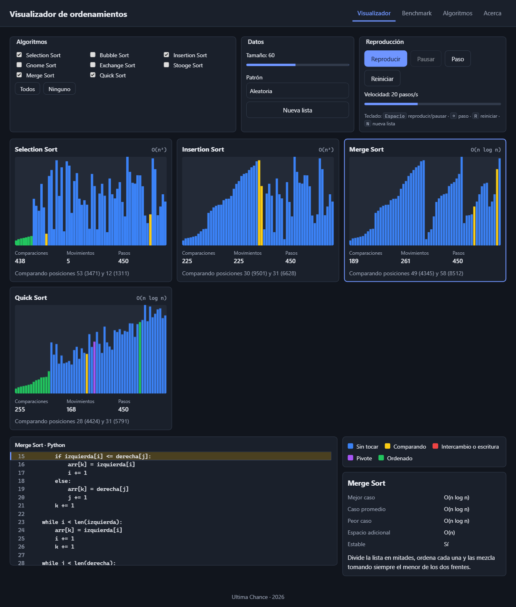
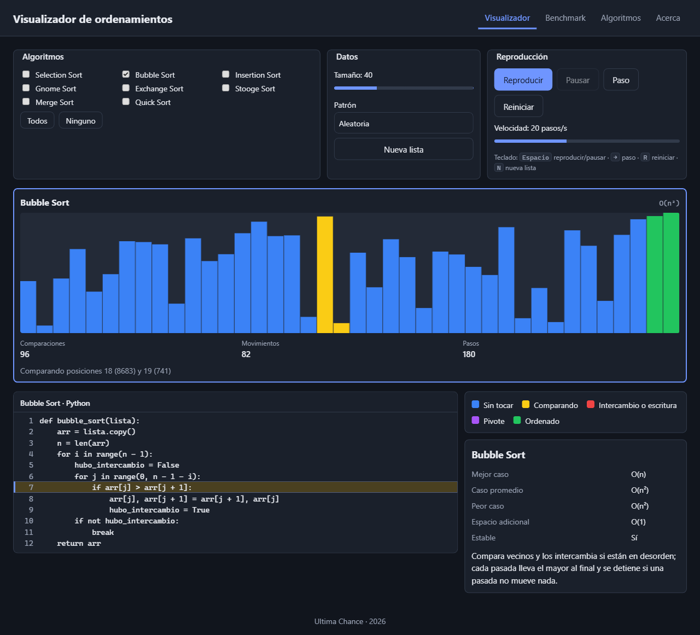
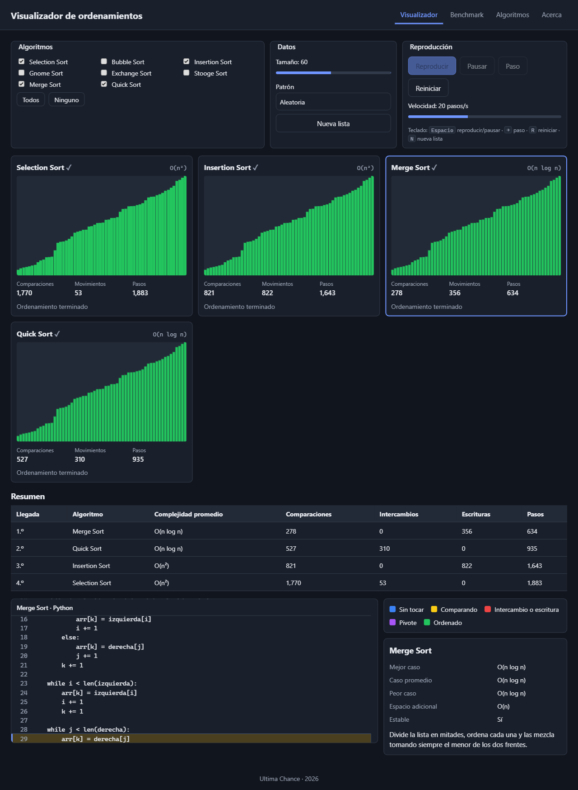
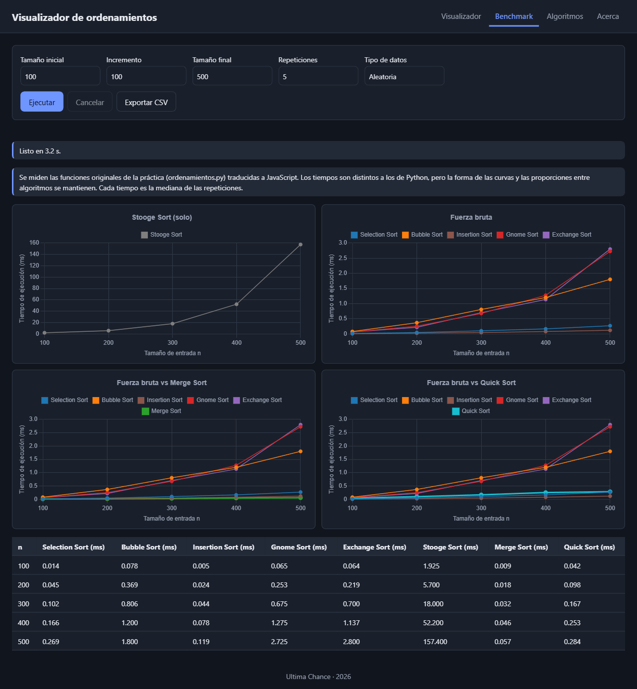
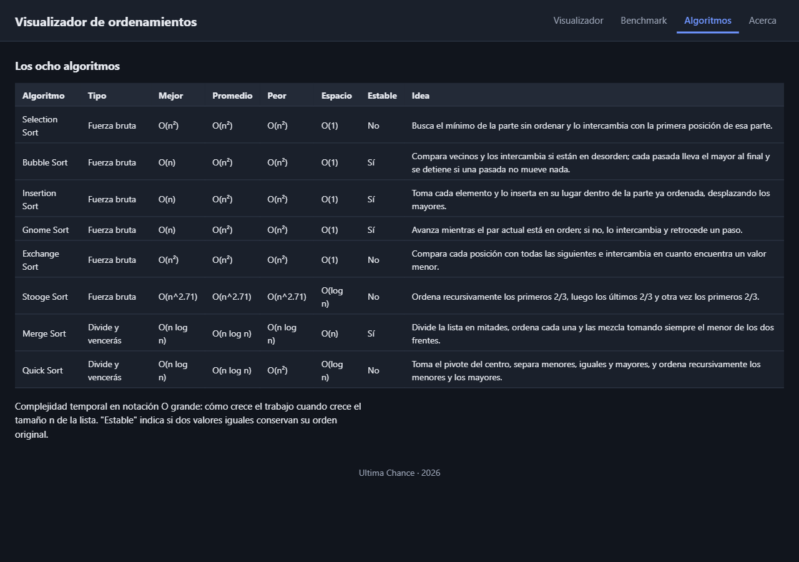

# Visualizador de ordenamientos

Aplicación web para **visualizar, ejecutar y comparar** los ocho algoritmos de ordenamiento vistos
en clase: Selection, Bubble, Insertion, Gnome, Exchange, Stooge, Merge y Quick Sort. Muestra qué
elementos se comparan, cuáles se intercambian, qué línea del código se está ejecutando y cómo
cambia el arreglo hasta quedar ordenado. También mide los tiempos reales de cada algoritmo, como la
práctica en Python de la que nace el proyecto.

**Aplicación publicada:** https://souls-nao.github.io/visualizador-ordenamientos/

**Repositorio:** https://github.com/Souls-Nao/visualizador-ordenamientos ·
**Tablero:** https://github.com/users/Souls-Nao/projects/2/views/1



## Equipo

**Ultima Chance**

| Integrante | Rol |
|---|---|
| Johan Daniel Gutierrez Nava | Desarrollo, pruebas y documentación (proyecto individual) |

## Qué se puede hacer

**Visualizador**
- Elegir uno, varios o todos los algoritmos (casillas y botones Todos / Ninguno).
- Generar una lista de 5 a 120 elementos con cuatro patrones: aleatoria, ordenada, invertida y casi
  ordenada.
- Reproducir, pausar, avanzar paso a paso y reiniciar con **la misma lista**.
- Cambiar la velocidad de 1 a 2000 pasos por segundo.
- Ver las barras con color según su estado, contadores en vivo (comparaciones, movimientos y pasos),
  un mensaje con la operación actual y el **código Python con la línea activa resaltada**.
- Consultar la ficha del algoritmo: complejidad en mejor, promedio y peor caso, espacio adicional,
  estabilidad y una descripción.

**Comparación**
- Todos los paneles arrancan con la misma lista y avanzan a la misma velocidad, así que termina
  primero el algoritmo que necesita menos pasos.
- Al terminar aparece una tabla con el orden de llegada, comparaciones, intercambios, escrituras y
  pasos de cada algoritmo.

**Benchmark**
- Mide los tiempos reales con tamaño inicial, incremento y tamaño final (las mismas entradas y
  validaciones que `main.py`), más repeticiones y tipo de datos.
- Dibuja las cuatro gráficas de `benchmark.py`, muestra una tabla y exporta a CSV.

**Extras:** atajos de teclado (Espacio, →, R, N), preferencias guardadas en el navegador, tabla
comparativa de los ocho algoritmos y diseño adaptable a celular.

| Un algoritmo | Resumen de la comparación |
|---|---|
|  |  |

| Benchmark | Pestaña Algoritmos |
|---|---|
|  |  |

## Cómo ejecutarlo

No necesita instalación ni compilación: es HTML, CSS y JavaScript. Como usa módulos de JavaScript,
**hay que abrirlo desde un servidor local**; abrir `index.html` directamente con doble clic no
funciona.

```bash
git clone https://github.com/Souls-Nao/visualizador-ordenamientos.git
cd visualizador-ordenamientos
python -m http.server 8000
```

Después abrir http://localhost:8000 en el navegador. También sirve la extensión **Live Server** de
VS Code.

**Pruebas:** con el servidor encendido, abrir http://localhost:8000/test.html. La página ejecuta 76
pruebas automáticas y debe mostrar "76 de 76 pruebas pasaron".

**Publicación:** GitHub Pages publica la rama `main` desde la raíz. Cada `push` a `main` actualiza
el sitio en uno o dos minutos.

## Los algoritmos

| Algoritmo | Tipo | Mejor | Promedio | Peor | Espacio | Estable | Idea |
|---|---|---|---|---|---|---|---|
| Selection Sort | Fuerza bruta | O(n²) | O(n²) | O(n²) | O(1) | No | Busca el mínimo de la parte sin ordenar y lo pone al inicio de esa parte. |
| Bubble Sort | Fuerza bruta | O(n) | O(n²) | O(n²) | O(1) | Sí | Compara vecinos y los intercambia; cada pasada lleva el mayor al final. |
| Insertion Sort | Fuerza bruta | O(n) | O(n²) | O(n²) | O(1) | Sí | Inserta cada elemento en su lugar dentro de la parte ya ordenada. |
| Gnome Sort | Fuerza bruta | O(n) | O(n²) | O(n²) | O(1) | Sí | Avanza si el par está en orden; si no, lo intercambia y retrocede. |
| Exchange Sort | Fuerza bruta | O(n²) | O(n²) | O(n²) | O(1) | No | Compara cada posición con todas las siguientes e intercambia al encontrar un menor. |
| Stooge Sort | Fuerza bruta | O(n^2.71) | O(n^2.71) | O(n^2.71) | O(log n) | No | Ordena los primeros 2/3, los últimos 2/3 y otra vez los primeros 2/3. |
| Merge Sort | Divide y vencerás | O(n log n) | O(n log n) | O(n log n) | O(n) | Sí | Divide en mitades, ordena cada una y las mezcla. |
| Quick Sort | Divide y vencerás | O(n log n) | O(n log n) | O(n²) | O(log n) | No | Toma un pivote, separa menores, iguales y mayores, y ordena cada grupo. |

Cada algoritmo está en su propio archivo: `js/algoritmos/<nombre>Sort.js`.

**Relación con la práctica en Python** (`docs/referencia/ordenamientos.py`). La práctica es la base.
Para el visualizador se hicieron solo los cambios necesarios, y el código Python que se muestra en
pantalla ya los incluye:
- **Selection** solo intercambia si el mínimo no está en su lugar.
- **Bubble** recorre solo la parte sin ordenar y termina si una pasada no intercambia.
- **Merge** trabaja con índices `lo`/`hi` sobre un solo arreglo, para dibujarlo como una fila de
  barras, y compara con `<=` para ser estable.
- **Quick** acomoda los tres grupos (menores, iguales y mayores) dentro del mismo arreglo en lugar de
  crear listas nuevas.

El **benchmark** mide las funciones originales de la práctica sin estos cambios
(`js/benchmark/fieles.js`).

## Cómo funciona

```
generador del algoritmo ──yield──► evento { type, indices, line }
                                      │
             ┌────────────────────────┼─────────────────────┐
             ▼                        ▼                     ▼
      espejo del arreglo       contadores (métricas)    línea de código
             │                        │                     │
      barras en el canvas     números del panel       panel de código
```

1. **Los algoritmos no dibujan.** Cada uno es una función generadora (`function*`) que, en cada
   operación, emite un *evento*: comparar, intercambiar, escribir, pivote u ordenado, con los índices
   involucrados y la línea de Python que representa (`docs/eventos.md`).
2. **El espejo** (`js/render/espejo.js`) aplica cada evento a una copia del arreglo y calcula el color
   de cada barra. `js/render/canvasBarras.js` lo dibuja en un canvas.
3. **El reproductor** (`js/motor/reproductor.js`) usa `requestAnimationFrame` y un acumulador de
   tiempo para decidir cuántos pasos tocan en cada cuadro según la velocidad elegida.
4. **La escena** (`js/ui/escena.js`) reparte esos pasos entre todos los paneles, que comparten la
   misma lista base, y registra el orden de llegada.
5. **El benchmark** corre en un Web Worker (`js/benchmark/worker.js`) para no congelar la página.

**Dónde se calcula cada métrica**
- Comparaciones, intercambios, escrituras, movimientos y pasos: `registrarEvento` en
  `js/core/metricas.js`, con las mismas reglas para los ocho algoritmos.
- Orden de llegada y resumen: `js/ui/escena.js`.
- Tiempos: `medirLote` en `js/benchmark/worker.js`. Antes de medir se hace un calentamiento, cada
  medición es un lote de al menos 5 ms dividido entre sus vueltas (el navegador redondea el reloj a
  unos 0.1 ms) y se guarda la mediana de las repeticiones.

## Estructura

```
index.html · test.html
css/            base.css · layout.css · componentes.css
js/main.js      punto de arranque
js/config.js    límites y ajustes
js/core/        eventos.js · datos.js · metricas.js
js/algoritmos/  un archivo por algoritmo · index.js (registro) · fuentesPython.js
js/render/      espejo.js · canvasBarras.js
js/motor/       reproductor.js
js/ui/          escena.js · panelAlgoritmo.js · panelCodigo.js · controles.js · ficha.js · …
js/benchmark/   fieles.js · worker.js · benchmark.js · graficas.js · csv.js
vendor/         Chart.js 4.4.7 (licencia MIT)
docs/           eventos.md · capturas/ · referencia/ (práctica en Python y conteos.py)
```

## Documentación

- [BLOQUES.md](BLOQUES.md): el proyecto dividido en 14 bloques de desarrollo, con lo que exporta y
  consume cada uno, constantes, IDs del HTML y cambios de contrato.
- [DIARIO.md](DIARIO.md): explicación de cada bloque, de las decisiones y de los problemas
  encontrados.
- [docs/eventos.md](docs/eventos.md): el formato de los eventos que emiten los algoritmos.
- `docs/referencia/`: la práctica original (`ordenamientos.py`, `benchmark.py`, `main.py`) y
  `conteos.py`, que genera los conteos esperados de las pruebas ejecutando el mismo Python que muestra
  la página.

## Pruebas

`test.html` reúne 76 pruebas que se ejecutan en el navegador, entre ellas:
- los 8 algoritmos ordenan 27 listas (casos borde y los 4 patrones) sin modificar la entrada;
- hacen **las mismas comparaciones y escrituras** que el código Python mostrado en pantalla;
- cada línea resaltada corresponde a la operación que se anima;
- espejo, reproductor (con reloj simulado), panel de código, métricas, paneles, comparación, versiones
  fieles, validación del formulario, Web Worker y CSV.

**Limitaciones conocidas**
- Los tiempos del benchmark varían un poco entre ejecuciones y entre navegadores; con listas pequeñas
  el ruido relativo es mayor. Más repeticiones dan curvas más estables.
- Stooge Sort se limita a 30 elementos en el visualizador y a 500 en el benchmark por su crecimiento
  n^2.71.
- En Merge Sort, al comparar se resalta la posición de donde salió el valor izquierdo; esa barra puede
  ya estar sobrescrita, porque el valor real está en la copia `izquierda`.
- Tras publicar un cambio, el navegador puede mostrar la versión anterior unos minutos (caché de
  GitHub Pages); se soluciona recargando con Ctrl + F5.

## Tecnologías

HTML5, CSS3 y JavaScript con módulos, sin frameworks ni compilación. Canvas 2D para las barras,
`requestAnimationFrame` para la animación, Web Workers para el benchmark y Chart.js (copia local)
para las gráficas. Publicado gratis en GitHub Pages.

## Uso de inteligencia artificial

Se usó Claude (Anthropic) como apoyo para planear, investigar referentes, escribir y revisar código,
detectar errores, redactar la documentación y preparar el despliegue, como permite la actividad. Las
decisiones del proyecto fueron del equipo. Cada commit hecho con apoyo de la IA lo indica con
`Co-Authored-By`, y el razonamiento de cada parte está explicado en [DIARIO.md](DIARIO.md) para poder
defenderlo en la revisión.

## Referencias

VisuAlgo (NUS), The Sound of Sorting (Timo Bingmann), alg0.dev (midudev) y otros visualizadores
abiertos listados en el documento de planeación, de los que se tomaron ideas de diseño, no código.
Documentación de MDN sobre `performance.now()`, Web Workers y Canvas, y la de GitHub Pages.
